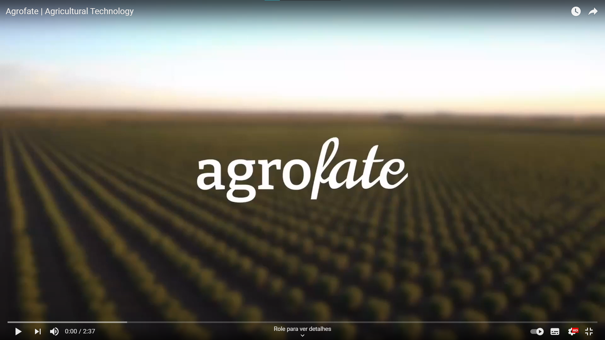
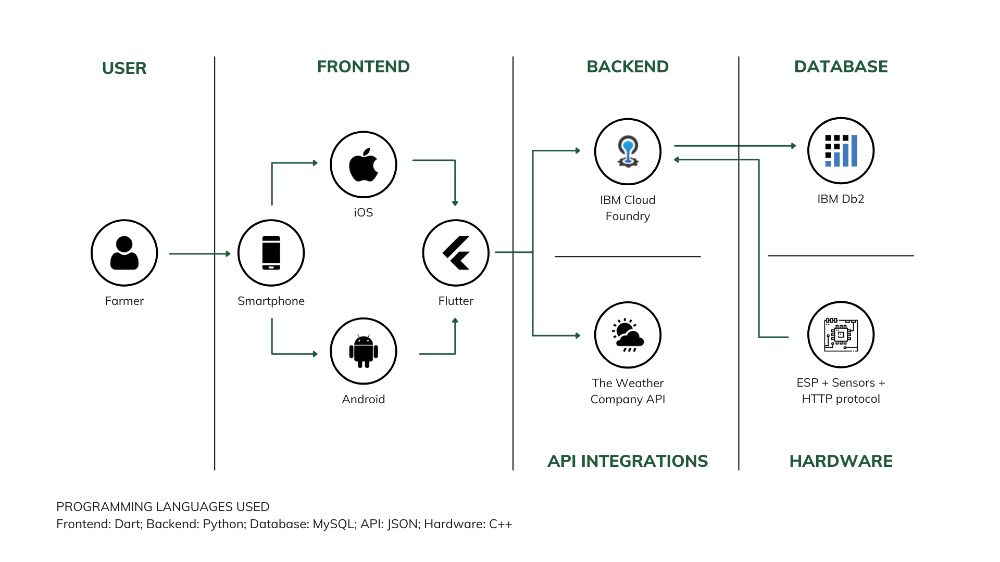
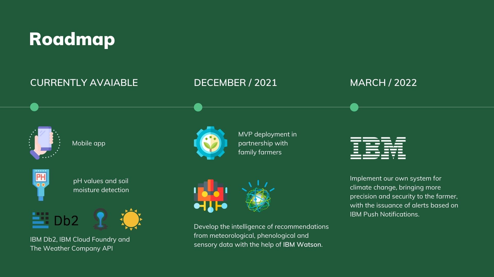

# Agrofate

Agrofate, a precision farming project aiming to develop accessible technologies for family farmer producers.

> Contact: agrofateoficial@gmail.com  
> Instagram: https://www.instagram.com/agrofate  
> LinkedIn: https://www.linkedin.com/company/74055018/admin/  
> Youtube Channel: https://www.youtube.com/channel/UCj8wCBdpc1-SblYblmI_CnA

## Contents

- [Short description](#short-description)
  - [What's the problem?](#whats-the-problem)
  - [How can technology help?](#how-can-technology-help)
  - [The idea](#the-idea)
- [Demo video](#demo-video)
- [The architecture](#the-architecture)
- [Long description](#long-description)
- [Project roadmap](#project-roadmap)
- [Getting started](#getting-started)
- [Live demo](#live-demo)
- [Built with](#built-with)
- [Contributing](#contributing)
- [Versioning](#versioning)
- [Authors](#authors)
- [License](#license)
- [Acknowledgments](#acknowledgments)

## Short description

### What's the problem?

Weather forecasting, irrigation and soil quality are very important characteristics for family farmers to develop their plantations efficiently. However, they don't have all this information quickly and accurately whenever they need it. This influences the excessive use of water, causing great waste, because the producers do not have the tools to base themselves on the really necessary amount of water resource.

### How can technology help?

The use of sensors, cloud and real-time services, as well as applications can bring resources to these producers to make better decisions about what to do to have an always productive and quality crop.

### The idea

Agrofate created a set of innovative solutions for these family farmers. With our mobile app the producer will be able to view the detailed weather forecasting, recommendations for better decision-making and plan your crops in a personalized way.
In addition, through our sensory equipment, we inform important data on acidity, moisture and soil nutrients.
As a differential, in relation to competitors, we align recommendations regarding climate and soil, based on real data.
With this, the farmer can rely on this information and control the use of water in irrigation and other products in other processes.

## Demo video

## The architecture

1. The Weather Company API for daily and hourly weather forecast;
2. IBM Cloud Foundry for database connection and requests;
3. IBM Db2 for data storage across the entire environment and application.

## Long description

Agricultural production is directly influenced by sun, rain, wind and temperature. Thus, climate change impacts agricultural processes on the planet.

However, what not everyone realizes is that agriculture also influences temperatures on Earth.

Agriculture is responsible for consuming 70% of the world's water resources.

Talking to some family farmers in São Paulo, we’ve identified some of the most common problems of small producers:

1. The lack of a better weather forecast leaves the farmer unprepared for climate change;
2. The alteration and lack of control of soil moisture, pH and nutrients cause the harvest to generate losses;
3. Finally, ineffective planning of fertilizer and defensive application.

Thinking about these problems, we’ve created a set of innovative solutions for these family farmers.With our mobile app the producer will be able to view the:
1. detailed weather forecasting, recommendations for better decision-making;
2. and plan your crops in a personalized way.
3. In addition, through our sensory equipment, we inform important data on acidity, moisture and soil nutrients.
As a differential, in relation to competitors, we align recommendations regarding climate and soil, based on real data.

The freemium business model is the foundation of Agrofate. This allows for a greater recurrence and decreases the barrier of market entry. We have 3 subscription plans, free, basic and premium. In the premium plan, the family farmer can purchase our equipment and have full access to the app.

We are committed to the Sustainable Development Goals.

We produce sensory equipment and mobile technologies for sustainable and more productive agriculture.

We recommend the amount of water required and the ideal time for crop irrigation, aiming at the conscious use of water resources.

We develop truly accessible solutions aimed at family farmers, the class most affected by the lack of financial resources.

Currently, the MVP is being installed and tested on a family farm located in the metropolitan region of São Paulo, Brazil.

**Agrofate, developing a more conscious future.**

## Project roadmap

Currently, the project has the following functionalities in operation:

- Create and change gantry;
- Create and change crops;
- Create and change fertilizers;
- Create and change defensives;
- Registration in time of ph values and soil moisture;
- The **IBM Cloud Foundry** app connects with the **IBM DB2** and register the real time data;
- Get the data from the **Weather Company API** and shows on app daily and hourly forecast.

First, we want to deploy our MVP application in partnership with some green belt farmers. Afterwards, finalize the system and intelligence recommendations from meteorological, phenological and sensory data with the help of **IBM Watson**.

In the second phase, we will implement our own system for climate change, bringing more precision and security to the farmer, with the issuance of alerts based on **IBM Push Notifications**.

## Getting started

**Prerequisite**
- Register for an IBM Cloud account.
- Request a Weather Company API key
- Install Arduino IDE (https://www.arduino.cc/en/software)

**Run It**
01. Download the Github code
02. Install flutter:
03. Here some links for this step:
*   https://flutter.dev/docs/get-started/install/windows
*   https://www.tutorialspoint.com/flutter/flutter_installation.htm
*   https://www.youtube.com/watch?v=tun0HUHaDuE
*   https://www.youtube.com/watch?v=9GuzMsZQUYs
04. Running the app: 
<code>flutter run --no-sound-null-safety</code>
05. Building packages: 
<code>flutter build --no-sound-null-safety</code>

06. After installed the Arduino IDE, open the Microcontroller_Code_Agrofate.ino (https://github.com/agrofate/agrofate/blob/main/agrofate-microcontroller/Microcontroller_Code_Agrofate.ino)
07. Change the Wifi name and password with your local data 
<code>const char* ssid = "WIFI_name";</code> 
<code>const char* password =  "WIFI_password";</code>
08. Connect the microcontroller (Esp32, arduino, etc) in your notebook or pc
09. Connect the ph and humidity sensors to the microcontroller and compile the code
10. Wait the code get compiled and go to your mobile app
11. If you don't have a registered email, click on the "Cadastrar" button and create an account. If you have already registered, enter login and password and click on "Login"
12. The "Previsão" screen shows temperature, humidity and wind speed values by day and hour
13. In the "Canteiros" screen, you can create new records and add crops, fertilizers and defensives, as well as consult the history of all these records
14. In the "Dados" screen you will see the recorded pH and humidity values of the sensors connected to the microcontroller

## Built with

- [IBM DB2 Cloud](https://cloud.ibm.com/catalog/services/db2) - The MySQL database used
- [IBM Cloud Foundry](https://cloud.ibm.com/login?redirect=%2Fcloudfoundry%2Foverview) - Connection and requests with database
- [IBM The Weather Company API](https://www.ibm.com/products/weather-company-data-packages) - The API for daily and hourly forecast weather
- [Python](https://www.python.org/) - Language programming for connect with database
- [Flutter](https://flutter.dev/) - SDK, natively compiled applications for mobile, web, and desktop from a single codebase
- Microcontroller and sensors - To detect crop ph and moisture in real time

## Authors

<!--  -->

- **Alexandre Russi Jr.** - _UX & Mobile Development_ - [LinkedIn](https://www.linkedin.com/in/alexandrerussi/)
- **Gabriel B. Cardoso** - _Mobile & Software Development_ - [LinkedIn](https://www.linkedin.com/in/gabriel-barbosa-cardoso-98b479a7/)
- **Guilherme G. Guimarães** - _Business & Marketing_ - [LinkedIn](https://www.linkedin.com/in/guilhermegguimaraes/)
- **Leonardo G. J. Gonçalez** - _Cloud Architect_ - [LinkedIn](https://www.linkedin.com/in/leonardo-gomes-jorge-gon%C3%A7alez-4910a7141/)
- **Nathan de Moraes** - _Product Development_ - [LinkedIn](https://www.linkedin.com/in/nathan-de-moraes-aa6302143/)
