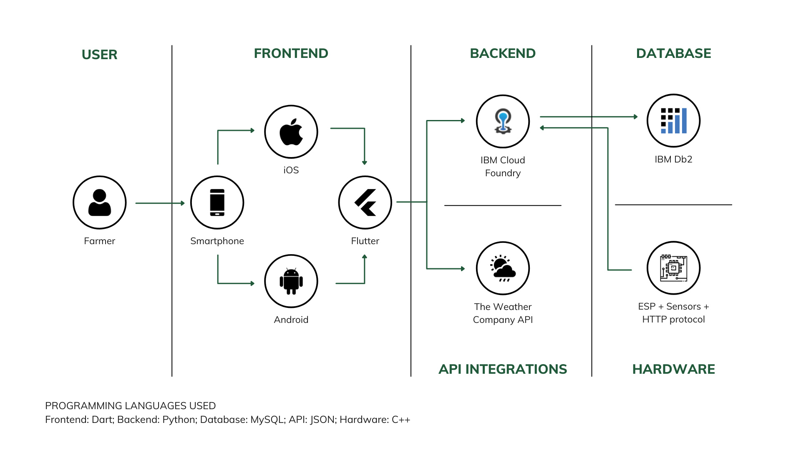
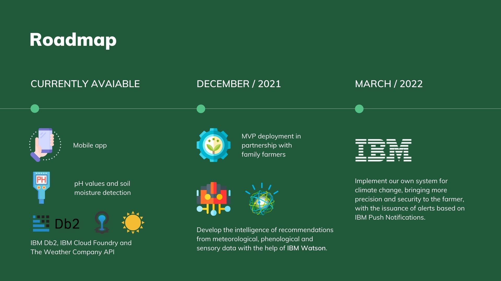

# Agrofate

<!--  -->

Agrofate, um projeto de agricultura de precisão com o objetivo de desenvolver tecnologias acessíveis aos produtores familiares.

> Contato: agrofateoficial@gmail.com  
> Instagram: https://www.instagram.com/agrofate  
> LinkedIn: https://www.linkedin.com/company/74055018/admin/  
> Canal do Youtube: https://www.youtube.com/channel/UCj8wCBdpc1-SblYblmI_CnA

*Read this in other languages: [English](../README.md), [português](README.pt_br.md).*

## Conteúdos

- [Descrição curta](#descrição-curta)
  - [Qual é o problema?](#qual-é-o-problema?)
  - [Como a tecnologia pode ajudar?](#como-a-tecnologia-pode-ajudar?)
  - [A ideia](#a-ideia)
- [Vídeo demo](#vídeo-demo)
- [Arquitetura](#arquitetura)
- [Descrição longa](#descrição-longa)
  - [Introdução](#introdução)
  - [Problema e Nossa Solução](#problema-e-nossa-solução)
  - [Objetivos de Desenvolvimento Sustentável](#objetivos-de-desenvolvimento-sustentável)
- [Roadmap do projeto](#roadmap-do-projeto)
- [Getting started](#getting-started)
- [Desenvolvido com](#desenvolvido-com)
- [Implementação/Piloto](#pilot)
- [Autores](#autores)

## Descrição curta

### Qual é o problema?

A previsão do tempo, a irrigação e a qualidade do solo são características muito importantes para que os agricultores familiares desenvolvam seus plantios de forma eficiente. No entanto, eles não têm todas essas informações com rapidez e precisão sempre que precisam. Isso influencia no uso excessivo da água, causando grande desperdício, pois os produtores não possuem ferramentas para se basear na quantidade de recurso hídrica realmente necessária.

### Como a tecnologia pode ajudar?

O uso de sensores, nuvem e serviços em tempo real, assim como aplicativos podem trazer recursos a esses produtores para tomarem melhores decisões sobre o que fazer para ter uma safra sempre produtiva e de qualidade.

### A ideia

A Agrofate criou um conjunto de soluções inovadoras para esses agricultores familiares. Com nosso aplicativo mobile o produtor poderá visualizar a previsão do tempo detalhada, recomendações para melhor tomada de decisão e planejar sua safra de forma personalizada.
Além disso, por meio de nossos equipamentos sensoriais, informamos dados importantes sobre acidez, umidade e nutrientes do solo.
Como diferencial, em relação aos concorrentes, alinhamos recomendações sobre clima e solo, com base em dados reais.
Com isso, o agricultor pode contar com essas informações e controlar o uso da água na irrigação e de outros produtos em outros processos.

## Vídeo demo

## Arquitetura

1. A API da The Weather Company para previsão do tempo diária e de hora em hora;
2. IBM Cloud Foundry para conexão de banco de dados e _requests_;
3. IBM Db2 para armazenamento de dados em todo o ambiente e aplicativo.

## Descrição longa

### Introdução

A produção agrícola é influenciada diretamente pelo sol, chuva, vento e temperatura. Portanto, as **mudanças climáticas impactam os processos agrícolas do planeta**. No entanto, o que nem todos percebem é que a agricultura também influencia as temperaturas na Terra.

A **agricultura é responsável pelo consumo de 70% dos recursos hídricos mundiais**. Irrigações mal executadas e falta de controle sobre a quantidade de água utilizada estão por trás do uso imprudente de água doce.

Além disso, 35 milhões de pessoas não têm acesso a água potável no Brasil, um país emergente e desigual. Esse cenário se repete em vários países do mundo e a Agrofate chega ao mercado para fazer a diferença e ajudar no combate às desigualdades.

Com o aumento da população mundial, a **demanda por alimentos tende a crescer exponencialmente**. Além disso, o agronegócio movimenta mais de 7,8 trilhões de dólares no mundo, sendo um dos principais setores de combate à fome no planeta.

### Problema e Nossa Solução

Conversando com alguns agricultores familiares em São Paulo, identificamos alguns dos problemas mais comuns dos pequenos produtores:

1. A falta de uma melhor previsão do tempo deixa o agricultor despreparado para as mudanças climáticas;
2. A alteração e o descontrole da umidade, pH e nutrientes do solo fazem com que a colheita gere perdas e prejuízos;
3. Finalmente, o planejamento ineficaz de fertilizantes e aplicação defensiva.

Pensando nesses problemas, criamos um conjunto de soluções inovadoras para esses agricultores familiares. Com nosso aplicativo, o produtor será capaz de visualizar:

1. Previsão meteorológica detalhada, recomendações para uma melhor tomada de decisão;
2. Planejamento de suas colheitas de forma personalizada;
3. Além disso, por meio de nossos equipamentos sensoriais, informamos dados importantes sobre acidez, umidade e nutrientes do solo.

Como diferencial, em relação aos concorrentes, alinhamos recomendações sobre clima e solo, com base em dados reais.

O modelo de negócios freemium é a base da Agrofate. Isso permite uma maior recorrência e diminui a barreira de entrada no mercado. Temos 3 planos de assinatura, grátis, básico e premium. No plano premium, o agricultor familiar pode adquirir nossos equipamentos e ter acesso total ao aplicativo.

### Objetivos de Desenvolvimento Sustentável

Estamos comprometidos com os Objetivos de Desenvolvimento Sustentável da ONU.

1. **Objetivo 2 | Fome Zero e Agricultura Sustentável:** produzimos equipamentos sensoriais e tecnologias móveis para uma agricultura sustentável e mais produtiva.

2. **Objetivo 6 | Água Limpa e Saneamento:** recomendamos a quantidade de água necessária e o momento ideal para a irrigação das lavouras, visando o uso consciente dos recursos hídricos.

3. **Objetivo 10 | Redução das Desigualdades**: desenvolvemos soluções verdadeiramente acessíveis voltadas para os agricultores familiares, a classe mais afetada pela falta de recursos financeiros.

**_Agrofate, pensando um futuro mais consciente._**

## Roadmap do projeto

Atualmente, o projeto conta com as seguintes funcionalidades em operação:

- Criar e alterar canteiros;
- Criar e alterar safras;
- Criar e alterar fertilizantes;
- Criar e alterar defensivas;
- Registro no tempo dos valores de ph e umidade do solo;
- O aplicativo **IBM Cloud Foundry** se conecta ao **IBM DB2** e registra os dados em tempo real;
- Obtêm os dados da API do **The Weather Company** e mostra no aplicativo a previsão diária e de hora em hora.

Primeiro, queremos implantar nosso MVP em parceria com alguns agricultores familiares. Depois, finalizar o sistema e inteligência das recomendações de dados meteorológicos, fenológicos e sensoriais com a ajuda do **IBM Watson**.

Na segunda fase, implementaremos nosso próprio sistema para mudanças climáticas, trazendo mais precisão e segurança ao agricultor, com a emissão de alertas utilizando o **IBM Push Notifications**.

## Getting started

**Prerequisite**
- Registre-se para uma conta IBM Cloud.
- Solicite uma chave API da Weather Company
- Instale o Arduino IDE (https://www.arduino.cc/en/software)

**Run It**
01. Baixe o código do Github
02. Instale o flutter:
03. Aqui estão alguns links para esta etapa:
*   https://flutter.dev/docs/get-started/install/windows
*   https://www.tutorialspoint.com/flutter/flutter_installation.htm
*   https://www.youtube.com/watch?v=tun0HUHaDuE
*   https://www.youtube.com/watch?v=9GuzMsZQUYs
04. Rodando o app: 
<code>flutter run --no-sound-null-safety</code>
05. Building packages: 
<code>flutter build --no-sound-null-safety</code>

06. Depois de instalar o Arduino IDE, abra o Microcontroller_Code_Agrofate.ino (https://github.com/agrofate/agrofate/blob/main/agrofate-microcontroller/Microcontroller_Code_Agrofate.ino)
07. Altere o nome e a senha do Wifi com seus dados locais 
<code>const char* ssid = "WIFI_name";</code> 
<code>const char* password =  "WIFI_password";</code>
08. Conecte o microcontrolador (Esp32, arduino, etc) em seu notebook ou pc
09. Conecte os sensores de ph e umidade ao microcontrolador e compile o código
10. Espere o código ser compilado e vá para o seu aplicativo móvel
11. Se você não possui um e-mail cadastrado, clique no botão "Cadastrar" e crie uma conta. Se você já se cadastrou, digite login e senha e clique em "Login"
12. A tela "Previsão" mostra os valores de temperatura, umidade e velocidade do vento por dia e hora
13. Na tela “Canteiros”, você pode criar novos cadastros e agregar safras, fertilizantes e defensivos, além de consultar o histórico de todos esses cadastros
14. Na tela "Dados" você verá os valores registrados de pH e umidade dos sensores conectados ao microcontrolador

## Desenvolvido com

- [IBM DB2 Cloud](https://cloud.ibm.com/catalog/services/db2) - O banco de dados MySQL usado
- [IBM Cloud Foundry](https://cloud.ibm.com/login?redirect=%2Fcloudfoundry%2Foverview) - Conexão e solicitações com banco de dados
- [IBM The Weather Company API](https://www.ibm.com/products/weather-company-data-packages) - A API para previsão do tempo diária e de hora em hora
- [Python](https://www.python.org/) - Linguagem de programação para conexão com banco de dados
- [Flutter](https://flutter.dev/) - SDK, aplicativos compilados nativamente para celular, web e desktop a partir de uma única base de código
- Microcontrolador e sensores - Para detectar o pH e a umidade da cultura em tempo real

## Implementação/Piloto 
A Agrofate criou o aplicativo e o MVP está sendo instalado e testado em uma propriedade de agricultura familiar localizada na região metropolitana de São Paulo, Brasil.
* Data de início: 31 de julho de 2021
* Região: Brasil (São Paulo, Biritiba Mirim)
* Situação atual: Em andamento. Coletando dados.

## Autores

<!--  -->

- **Alexandre Russi Jr.** - _UX & Mobile Development_ - [LinkedIn](https://www.linkedin.com/in/alexandrerussi/)
- **Gabriel B. Cardoso** - _Mobile & Software Development_ - [LinkedIn](https://www.linkedin.com/in/gabriel-barbosa-cardoso-98b479a7/)
- **Guilherme G. Guimarães** - _Business & Marketing_ - [LinkedIn](https://www.linkedin.com/in/guilhermegguimaraes/)
- **Leonardo G. J. Gonçalez** - _Cloud Architect_ - [LinkedIn](https://www.linkedin.com/in/leonardo-gomes-jorge-gon%C3%A7alez-4910a7141/)
- **Nathan de Moraes** - _Product Development_ - [LinkedIn](https://www.linkedin.com/in/nathan-de-moraes-aa6302143/)
